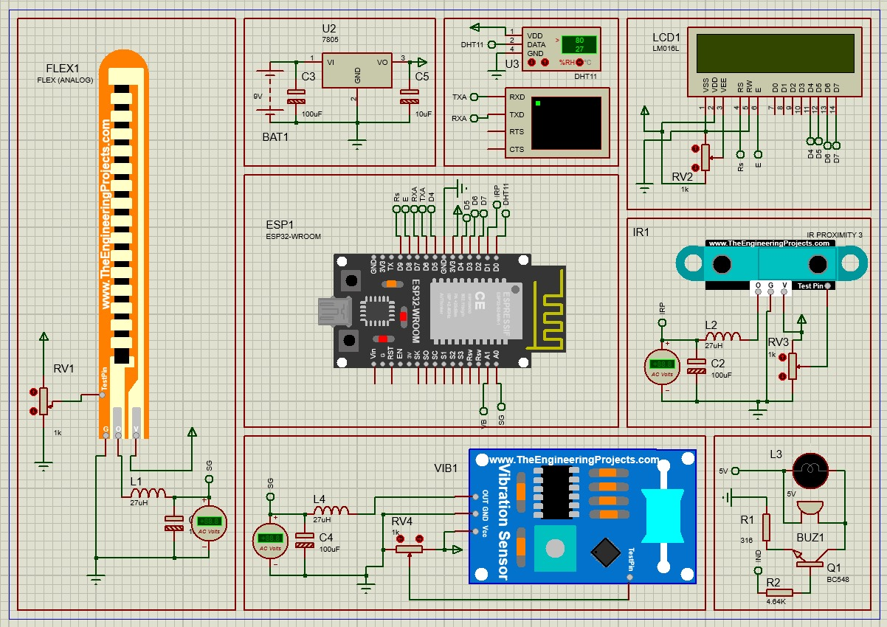

IoT-Based Structural Health Monitoring System

Overview

This project implements a real-time structural health monitoring system that uses sensors and IoT technology to continuously monitor the condition of buildings and infrastructure.

---

Objectives

* Detect structural damage early
* Monitor deformation, vibration, and tilt
* Provide real-time remote monitoring
* Improve safety and reliability

---

Block Diagram

 SHM CIRCUIT.jpeg

---

 Working Principle

* Sensors measure structural parameters
* Signals converted to digital data
* ESP32 processes sensor readings
* transmitted via Wi-Fi to cloud
* Dashboard visualizes data
* Alerts sent when thresholds exceeded

---

Components Used

* ESP32 Microcontroller
* Flex Sensor
* Vibration Sensor
* IR Proximity Sensor
* DHT11 Temperature Sensor
* LCD Display
* Buzzer
* Power Supply Unit

---

SHM CIRCUIT

---

IoT Features

* Real-time cloud monitoring
* Remote data access
* Data logging & analysis
* Smartphone alerts
* Dashboard visualization

---

Applications

* Building safety monitoring
* Bridge monitoring
* Industrial structures
* Earthquake-prone zones
* Infrastructure maintenance

---

Future Scope

* AI-based damage prediction
* Wireless sensor networks
* Integration with smart cities
* Automated emergency response

---

